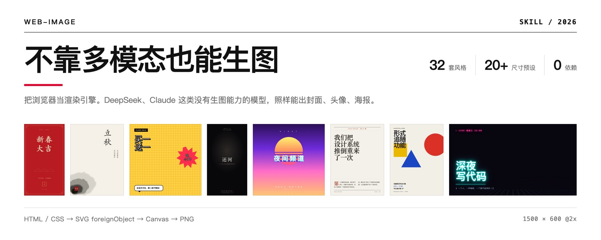
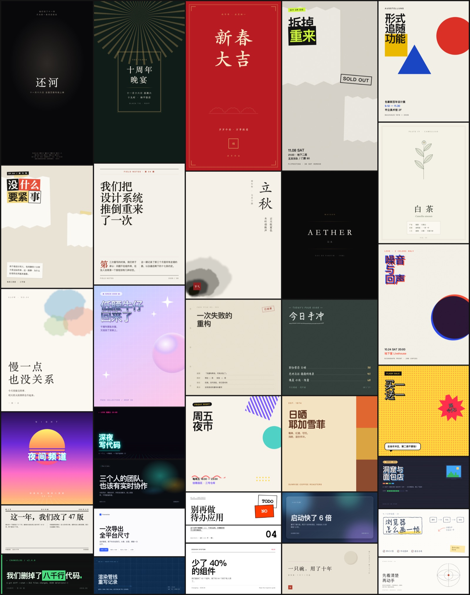

# web-image

**用前端渲染生成图片。** 不依赖模型的多模态能力，也不绑定特定 agent ——
任何能写 HTML/CSS 的模型（DeepSeek、Claude、Kimi、GPT…）配任何能读文件的 coding agent
（Claude Code、Codex、OpenCode、Cursor、Cline…）都能用。



**32 套预设风格开箱即用，想要别的直接说** —— 描述一个参照物（"像 A24 电影海报"、
"八十年代香港霓虹招牌"、"我们品牌是莫兰迪色系"），AI 会把它拆成一套可执行的设计规则再实现出来。

## 解决什么问题

市面上的生图 skill 大多依赖模型自身的多模态能力，对 DeepSeek 这类很强但不能生图的模型完全失效。

这个 skill 换了条路：**把浏览器当渲染引擎**。用 HTML/CSS 精确描述画面，导出成真实像素的 PNG。
产物可复现、可微调、可版本管理——而不是一次性的随机结果。

代价是：做不了照片级内容（人像、风景、材质渲染），那仍然需要真正的图像模型。
强项是排版驱动的图——封面、头像、卡片、Banner、数据图、海报、代码图。

## 风格：32 套预设，也可以自己描述

### 预设的 32 套

每套都有明确出身和**签名手法**——那一招才是辨识度所在，配色只是入场券。
用的时候直接点名：「用工程蓝图风格做张公众号封面」。



<details>
<summary>完整列表</summary>

| 分组 | 风格 |
|---|---|
| 印刷传统 | 瑞士国际主义 · 杂志编辑部 · 报纸 · 工程蓝图 · 档案手稿 |
| 艺术运动 | 包豪斯 · 装饰艺术 · 双色印刷 Riso · 粗野主义 · 孟菲斯 · 拼贴 |
| 东方 | 日式侘寂 · 中式水墨 · 国潮 |
| 手作纸感 | 手绘 · 黑板 · 水彩 · 博物图鉴 |
| 流行文化 | 美漫波普 · 像素 8-bit · 千禧 Y2K · 蒸汽波 · 霓虹赛博 · 街头海报 |
| 影像商业 | 电影海报 · 复古未来 70s · 极简线条 · 玻璃拟态 · 终端 · 极光 · 奢侈品 · 极简产品 |

每套还标了「常用画幅」——风格和画幅是配套的，你不指定尺寸时它按这个来。

</details>

### 想要预设之外的风格，直接描述

**32 套是起点，不是上限。** 说一个参照物就行：

```
"像 A24 电影海报那样"
"八十年代香港霓虹招牌"
"我们品牌是莫兰迪色系 + 圆润无衬线"
"《POPEYE》那种日式杂志内页"
"《银翼杀手 2049》的橙色沙尘"
```

AI 会按 `references/styles.md` 里的**四步法**把参照物拆成一套可执行的规则：

| 步骤 | 干什么 |
|---|---|
| **1. 取 4 个色** | 底色 / 主文字 / 次要文字 / 一个重音色。数出来超过 5 个说明还没看准 |
| **2. 定字体反差** | 哪一对在打架？衬线 vs 等宽、900 vs 300、全大写宽字距 vs 常规 |
| **3. 找签名手法** | 这个风格**独有的那一招**是什么？一条线？一种错位？一个形状？找不到就别动手 |
| **4. 定留白比例** | 35% / 55% / 70%，三选一 |

拆完就照 `design.md` 里的中文排版、构图和纹理配方实现——和预设风格走的是同一条流水线，
质量不会因为"不在库里"而打折。

你也没指定风格的话，它会按内容气质报 3~4 个候选让你挑，而不是默认套一个。

## 两条导出通道

| | 页内按钮 | `scripts/shot.mjs` |
|---|---|---|
| 原理 | 克隆节点 → 内联 computed style → SVG `foreignObject` → canvas | 本机 Chrome headless 渲染后截图 |
| 依赖 | 无 | 本机 Chrome / Chromium / Edge |
| 速度 | 单张即时 | ~1.5s/张，默认 3 并发 |
| 适合 | 边调边看、复制到剪贴板 | 出最终稿、批量、CI |

两条通道读同一份 HTML。SVG 滤镜、`mix-blend-mode`、`background-clip:text`、
`writing-mode` 竖排、`clip-path` 都已实测支持。

## 安装

这个 skill 不绑定任何特定 agent —— 它本质上就是**一组 Markdown 说明 + 两个 Node 脚本**。
只要你的 agent 能读文件、能跑 shell，把 `SKILL.md` 送进它的上下文就能用。

### 方式一：让你的 agent 自己装（推荐）

把下面整段发给 Claude Code / Codex / OpenCode / Cursor / Cline / 任何 coding agent：

```text
帮我安装 web-image skill：

1. 克隆到你的技能目录（你比我清楚该放哪）：
   git clone --depth 1 https://github.com/whyubel1eve/web-image-skill.git <你的技能目录>/web-image
   - Claude Code 放 ~/.claude/skills/web-image
   - 其他 agent 放到你自己的 skills / rules / prompts / 扩展目录
   - 如果你没有技能目录机制，放到项目里任意位置，然后把 SKILL.md
     的路径写进你的 AGENTS.md / .cursorrules / CLAUDE.md 之类的常驻配置里

2. 读一遍 web-image/SKILL.md，那是入口：里面有生图流程，
   以及 references/ 下四份参考文档各自该在什么时候读。不用一次读完全部。

3. 检查依赖并告诉我结果：
   - node -v            （批量出图和拼版脚本需要，没有也能用页面里的导出按钮）
   - Chrome / Chromium  （精确出图通道需要，没有则只用页内导出）

4. 自检：node web-image/scripts/shot.mjs web-image/examples/styles.html --only swiss
   能生成 PNG 就算装好了。
```

### 方式二：安装脚本

```bash
curl -fsSL https://raw.githubusercontent.com/whyubel1eve/web-image-skill/main/install.sh | bash
```

脚本会自动探测已有的技能目录、检查 Node 和 Chrome、并**真的渲染一张图做自检**。
指定目录：

```bash
curl -fsSL .../install.sh | bash -s -- ~/.config/your-agent/skills
# 或 clone 下来后： ./install.sh ~/my/skills
```

探测不到已知目录时它会装到当前目录，**不会瞎猜路径**。

### 方式三：手动

```bash
git clone --depth 1 https://github.com/whyubel1eve/web-image-skill.git ~/.claude/skills/web-image
```

换成你的 agent 对应的目录即可。

### 各家 agent 怎么接

| Agent | 怎么接 |
|---|---|
| **Claude Code** | 放进 `~/.claude/skills/web-image/`，自动识别 `SKILL.md` |
| **有技能/插件机制的** | 放进它的技能目录，入口指向 `SKILL.md` |
| **只有常驻配置文件的**<br>（`AGENTS.md` / `.cursorrules` / `.clinerules` 等） | 仓库放任意位置，在配置文件里加一行：<br>`生图任务参考 <path>/web-image/SKILL.md` |
| **纯对话式的** | 把 `SKILL.md` 内容直接贴进对话；需要时再贴对应的 `references/*.md` |

**依赖**：Node.js（可选，用于批量出图和拼版）、Chrome/Chromium（可选，用于精确出图）。
两个都没有时，仍可用画板页面里的导出按钮——那条通道是零依赖的纯浏览器实现。

## 用法

```bash
# 看 32 套风格样张（每套用它最擅长的画幅 + 真实场景文案）
open ~/.claude/skills/web-image/examples/styles.html

# 批量精确出图
node ~/.claude/skills/web-image/scripts/shot.mjs out/index.html --scale 2

# 把出好的图拼成一张总览（justified 打包，各列等高，底部不留空洞）
node ~/.claude/skills/web-image/scripts/contact.mjs out/png/*.png --cols 5 --label
```

## 结构

```
SKILL.md              流程与风格协商
references/
  styles.md           32 套风格：出身 · token · 签名手法 · 常用画幅
  formats.md          20+ 尺寸预设 + 各平台安全区 + 打印换算
  scenes.md           17 种场景配方：结构 · 文案字数上限 · 翻车点
  design.md           中文排版 · 构图 · 高级感技法 · 纹理配方 · AI 味清单
  export.md           两条通道对比 · 硬限制 · 图片内嵌 · 排错表
assets/               工作台外壳 + 零依赖导出引擎
scripts/              shot.mjs 精确出图 · contact.mjs 拼版
examples/             多画幅范例 + 32 套风格样张
```

## 一些实现细节

- **导出引擎**把节点的 computed style 逐条内联进 SVG `foreignObject`，只写与标签默认值不同的属性以控制体积，并单独把 `::before/::after` 提取成 class 规则——否则伪元素会在快照里全部丢失。
- **`shot.mjs` 不等 Chrome 退出**。Chrome 常因拉起 GoogleUpdater 之类的孙进程而迟迟不退，改成轮询产物文件、大小稳定即收工，单张从 45s 降到 1.5s。
- **有机形状**（墨迹、水彩、毛边）用 SVG `feTurbulence` + `feDisplacementMap` 打散规整形状的边缘。`border-radius` + `blur` 只会得到一个模糊的椭圆。
- **中文排版**不要用 `max-width:…ch` 控制折行——`ch` 是字符 "0" 的宽度，一个汉字约占 2ch，算出来差一倍，很容易折出孤字。

## License

MIT
